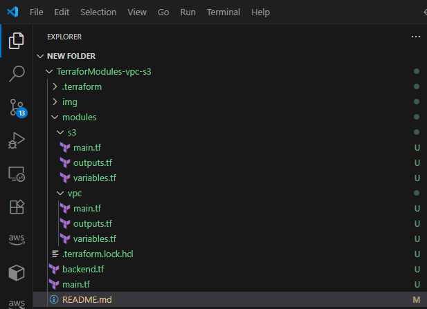
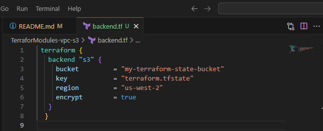
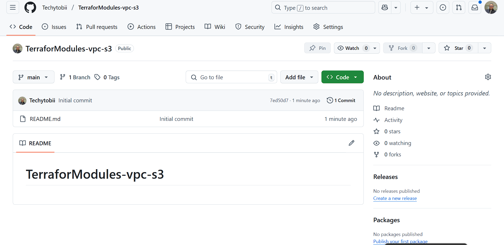
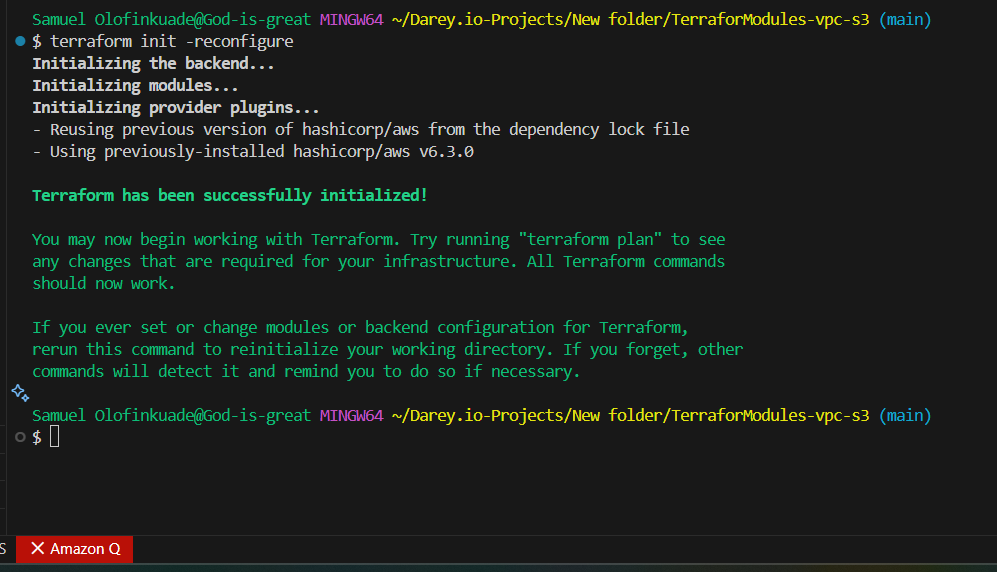

# TerraforModules-vpc-s3# Mini Project: Terraform Modules - VPC and S3 Bucket with Backend Storage

---
## 🎯 Objectives

✅ Develop reusable Terraform modules for infrastructure provisioning.  
✅ Deploy a Virtual Private Cloud (VPC) with required subnets and networking components.  
✅ Create an Amazon S3 bucket for Terraform state file storage.  
✅ Implement remote backend configuration in Terraform to store and manage state securely in S3.  
✅ Understand and apply Infrastructure as Code (IaC) best practices with Terraform.

---

## 🛠️ Prerequisites

Ensure you have the following before starting:

- **Terraform** installed → [Download Terraform](https://developer.hashicorp.com/terraform/downloads)  
- **AWS Account** with permissions to:
  - Create and manage VPCs
  - Create S3 buckets
- Configured AWS CLI profile or environment variables:
  ```bash
  aws configure
  ```
- Git installed locally for version control.

---

## 🗂️ Project Structure

Here’s a recommended folder layout for your project:

```
/terraform
  /modules
    /vpc
      - main.tf
      - variables.tf
      - outputs.tf
    /s3
      - main.tf
      - variables.tf
      - outputs.tf
  /environments
    /dev
      - main.tf
      - backend.tf
      - variables.tf
      - outputs.tf
README.md
```

- **modules/** → Reusable Terraform building blocks.  
- **environments/** → Environment-specific deployments (e.g., dev, prod).

>> 

---

## 🪣 Terraform Backend Configuration

Example backend configuration (`backend.tf`):

```hcl
 terraform {
   backend "s3" {
     bucket         = "my-terraform-state-bucket"
     key            = "terraform.tfstate"
     region         = "us-west-2"
     encrypt        = true
   }
  }
```
>> 

---

## 🚀 How to Deploy

### 1. Clone the Repository

```bash
git clone https://github.com/Techytobii/TerraforModules-vpc-s3.git
cd TerraforModules-vpc-s3
```
>> 


### 2. Initialize Terraform

```bash
terraform init
```

### 3. Review the Execution Plan

```bash
terraform plan
```

### 4. Apply Changes

```bash
terraform apply
```

Confirm with `yes` when prompted.


---

## 🔐 Security Considerations

- Enable versioning on your S3 bucket for Terraform state history.
- Apply least-privilege IAM policies for Terraform to manage only necessary resources.
- Never commit sensitive credentials or secrets to version control.

---

## 📸 Screenshots / Images



---

## ✅ Outputs

Upon successful deployment, Terraform will output:

- VPC ID
- Subnet IDs
- S3 Bucket Name
- (Any other relevant outputs)

---

## 👤 Author

- **Oluwatobi Olofinkuade**
- GitHub: [https://github.com/Techytobii/TerraforModules-vpc-s3](https://github.com/Techytobii/TerraforModules-vpc-s3)

---